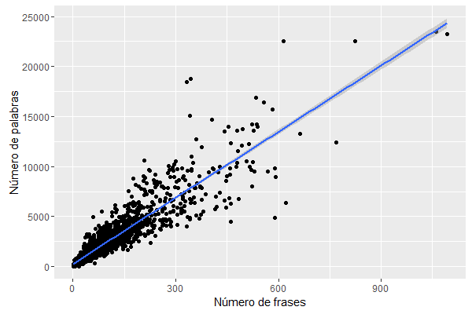

```{r setup, include=FALSE}
knitr::opts_chunk$set(echo = TRUE)
```

## Introducción

Antes de modelizar un set de datos, es recomendable realizar una serie de análisis exploratorios. Estos son una serie de gráficos e indicadores estadísticos sencillos que nos permiten hacernos una idea del tipo de datos que se va a estudiar.

Por ejempo, la siguiente gráfica nos permite observar que el número de palabras en el discurso está fuertemente correlacionado con el número de frases.



En esta tarea cargaremos todos los discursos disponibles (se han minado en otra tarea) y haremos un análisis exploratorio de ellos.

## Paquetes recomendados

* `dplyr`
* `ggplot2`
* `rjson`

## Objetivos

Se deberá responder a las siguientes preguntas:

* ¿Se aprecia alguna evolución temporal en la duración de los discursos?
* ¿Existe alguna relación entre el número de palabras total y el número de palabras que aparecen al menos una vez? (en "la casa de la abuela" tiene 5 palabras totales y 4 que aparecen al menos una vez).
* La relación entre el número de palabras que aparecen al menos una vez y el número total de frases se puede utilizar como un indicador de la amplitud del vocabulario del speaker. ¿Existen algunos que sean particularmente buenos o malos?
* ¿Se aprecia alguna evolución temporal de la "amplitud de vocabulario"?


