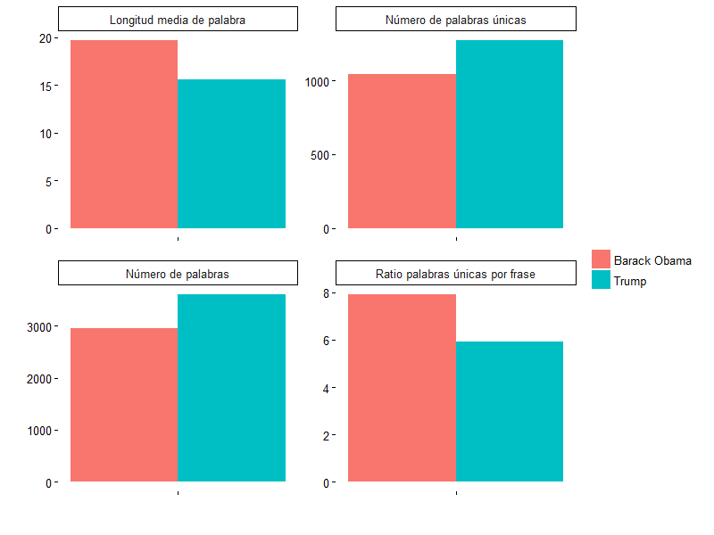

```{r setup, include=FALSE}
knitr::opts_chunk$set(echo = TRUE)
```

## Introducción

Una representación gráfica es una herramienta muy práctica para sacar conclusiones rápidamente de un conjunto de datos. En esta tarea se implementará una función que compare en una gráfica los discursos de dos personas diferentes. Esta función analizará los archivos tipo .json que se han generado en tareas anteriores.

## Paquetes recomendados

* dplyr
* tidyr
* ggplot2
* rjson

## Descripción de la función a implementar

### Detalles del input

La función tendrá dos argumentos:

* `speaker_1`: un character identificando al primer speaker.
* `speaker_2`: un character identificando al segundo speaker.

## Detalles del output

La función generará una gráfica comparando diversos indicadores cuantitativos de los discursos de ambos speakers. La siguiente gráfica muestra un ejemplo de el tipo de gráfica que se puede generar. Sin embargo, el alumno es libre de utilizar otros indicadores distintos a los mostrados aquí, o incluso utilizar otro tipo de representación gráfica.




