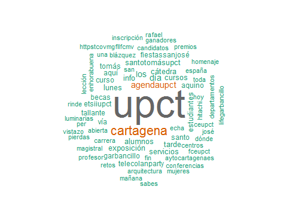

```{r setup, include=FALSE}
knitr::opts_chunk$set(echo = TRUE)
```

## Trabajo a realizar

Una nube de palabras es un gráfico en el que se muestran las palabras más utilizadas en un documento o un conjunto de documentos, proporcionando una primera idea sobre su contenido.



En esta tarea se utilizará la transcripción de un discurso crear una nube de palabras como la de la siguiente figura. Se utilizará como input un archivo tipo .rjson como los creados en la primera tarea del proyecto. En el repositorio del proyecto contiene algunos archivos que se pueden utilizar.

Es importante tener en cuenta las *stopwords*. Éstas son palabras de un idioma que aparecen muy frecuentemente pero no poseen un significado. Son un ejemplo de este tipo de palabras los artículos y las preposiciones. Es importante eliminarlas a la hora de crear la nube de palabras porque, si no, las *stopwords* ocultarán a las palabras que realmente poseen un significado. El paquete `tm` contiene funciones para omitir *stopwords*.

## Paquetes recomendados

* `tm`
* `wordcloud`
* `rjson`
